# 🌟 Eden Gilbert Kiseka

<!-- Dynamic Header with Material 3 Design Language -->
<picture>
<source media="(prefers-color-scheme: dark)" srcset="https://readme-typing-svg.demolab.com?font=Google+Sans&weight=600&size=36&duration=2500&pause=800&color=D0BCFF&background=00000000&center=true&vCenter=true&multiline=true&width=900&height=120&lines=Full-Stack+Engineer+%F0%9F%9A%80;AI%2FML+%E2%80%A2+Mobile+%E2%80%A2+IoT+%E2%80%A2+Design;Crafting+Digital+Experiences+That+Matter">

</picture>

<!-- Material 3 Inspired Surface Elevation -->

<h3 style="color: #E6E1E5; font-family: 'Google Sans', sans-serif; font-weight: 500; margin-bottom: 16px;">
🎯 Building tomorrow's digital experiences with Material You principles
</h3>

Passionate about creating adaptive, accessible, and emotionally resonant applications that scale beautifully across platforms.

---

## 🎯 **Featured Work**
*Showcasing current professional and personal projects*

<table>
<tr>
<td width="50%">

### ⚡ **Neriko Electronics**
*Apr 2025 - Present*

**Designing reliable electrical systems and IoT solutions** with Flutter mobile monitoring, backed by PostgreSQL and Supabase architecture.

**Tech Stack:** Flutter • PostgreSQL • Supabase • IoT

</td>
<td width="50%">

### 🍕 **Pizza Vesuvio Platform**
*Full-Stack Solution*

**Complete restaurant platform** featuring Material You 3 design, built with cross-platform Flutter mobile app.

**Tech Stack:** Flutter • Material Design 3 • Firebase

</td>
</tr>
<tr>
<td width="50%">

### 🤖 **Forex Analysis Engine**
*AI Innovation*

**Leveraging TensorFlow & Scikit-learn** for real-time market prediction, presented in a cross-platform mobile dashboard with adaptive M3 theming.

**Tech Stack:** TensorFlow • Python • Flutter • Material 3

</td>
<td width="50%">

### 🎨 **Design System Library**
*Open Source*

**Comprehensive Flutter widget library** implementing Material Design 3 components with dynamic color theming and accessibility features.

**Tech Stack:** Flutter • Material 3 • Figma Design Tokens

</td>
</tr>
</table>

---

## 🚀 **Tech Arsenal**
*My toolkit for building modern, scalable, and intelligent applications*

### 📱 **Mobile Development**
   

### 🧠 **AI & Machine Learning**
   

### 🎨 **Design & Frontend**
   

### 🗄️ **Backend & Infrastructure**
   

---

## 📊 **GitHub Analytics**
*Activity metrics, language distribution, and contribution patterns*

  

---

## 🎓 **Learning Journey**
*Visual roadmap of current focus areas and skill development*

```mermaid
graph TD
    A[🎯 Current Focus 2025] --> B[Advanced UI/UX Design]
    A --> C[AI/ML Applications]
    A --> D[Cross-Platform Excellence]

    subgraph "Design Systems"
        B --> E[Material You 3]
        B --> F[Design Tokens]
        B --> G[Accessibility First]
    end

    subgraph "AI/ML Pipeline"
        C --> H[Real-time ML Models]
        C --> I[MLOps & Deployment]
        C --> J[Edge AI Implementation]
    end

    subgraph "Development Mastery"
        D --> K[Flutter Advanced Patterns]
        D --> L[Native iOS/Android]
        D --> M[Performance Optimization]
    end

    %% Material 3 Color Scheme %%
    style A fill:#6750A4,stroke:#D0BCFF,stroke-width:3px,color:#fff
    style B fill:#1976D2,stroke:#BBDEFB,stroke-width:2px,color:#fff
    style C fill:#FF9800,stroke:#FFE0B2,stroke-width:2px,color:#fff
    style D fill:#4CAF50,stroke:#C8E6C9,stroke-width:2px,color:#fff
    
    style E fill:#1C1B1F,stroke:#D0BCFF,stroke-width:2px,color:#fff
    style F fill:#1C1B1F,stroke:#D0BCFF,stroke-width:2px,color:#fff
    style G fill:#1C1B1F,stroke:#D0BCFF,stroke-width:2px,color:#fff
    style H fill:#1C1B1F,stroke:#FFE0B2,stroke-width:2px,color:#fff
    style I fill:#1C1B1F,stroke:#FFE0B2,stroke-width:2px,color:#fff
    style J fill:#1C1B1F,stroke:#FFE0B2,stroke-width:2px,color:#fff
    style K fill:#1C1B1F,stroke:#C8E6C9,stroke-width:2px,color:#fff
    style L fill:#1C1B1F,stroke:#C8E6C9,stroke-width:2px,color:#fff
    style M fill:#1C1B1F,stroke:#C8E6C9,stroke-width:2px,color:#fff
```

---

## 🤝 **Open to Collaboration**
*Areas where I'm passionate about making an impact*

<table>
<tr>
<th>🎨 UI/UX Innovation</th>
<th>🤖 AI/ML Projects</th>
<th>🎵 Creative Technology</th>
</tr>
<tr>
<td>Creating <strong>expressive and adaptive</strong> user experiences with Material Design 3, especially in FinTech and accessibility.</td>
<td>Building and deploying <strong>open-source AI solutions</strong> with Python, JavaScript, and IoT integration.</td>
<td>Fusing <strong>music production, content creation,</strong> and design systems to build unique digital products.</td>
</tr>
<tr>
<td>

</td>
<td>

</td>
<td>

</td>
</tr>
</table>

---

## 📫 **Let's Connect & Create**
*Always open to meaningful conversations and collaborations*

---

## ⚡ **Personal Dimensions**
*The human behind the code*

<table>
<tr>
<td align="center" width="33%">
<h3>🌍 Multilingual Creative</h3>

Speaking 6 languages informs my approach to <strong>cultural design fusion</strong> and creating globally accessible products.

</td>
<td align="center" width="33%">
<h3>🎧 Music Producer</h3>

Proficient in <strong>Ableton Live & FL Studio</strong>, handling global mixing and mastering projects with technical precision.

</td>
<td align="center" width="33%">
<h3>✍️ Content Creator</h3>

Contributing to <strong>community building</strong> and exploring the intersection of storytelling and technology.

</td>
</tr>
</table>

---

### ✨ *"Innovation happens when creativity meets technology"* ✨

